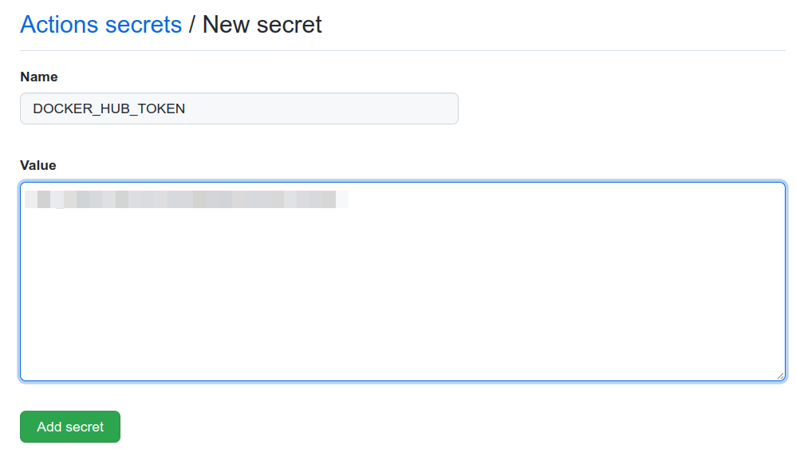

# GitHub actions for the API

The GitHub actions for the API are going to be a little more complex than
the ones we did for the Library.

In this case we want:

1. To run the tests to ensure everything is OK, before each push or
pull request
1. Generate a new container image each time a new version of the API is created

## Running tests action

This is going to be very similar to the one we did for the Library. You can just
copy the same workflow file definition.

First create the workflows folder:

```sh
mkdir -p .github/workflows
```

Next create the `.github/workflows/test.yaml` file with the following contents:

```yaml
name: Test

on:
  push:
  pull_request:

jobs:

  build:
    runs-on: ubuntu-latest
    steps:
    - uses: actions/checkout@v2

    - name: Set up Go
      uses: actions/setup-go@v2
      with:
        go-version: 1.17

    - name: Test
      run: go test -v ./...
```

This workflow will run tests recursively on any `push` or `pull_request` .

We can test this workflow using [act](it2-github-action-running-locally.md).

To execute `act` simulating a `push` event run the following command:

```sh
act push
```

The first execution will take some time as the docker containers need to be
downloaded but in the end you should see something like:

```
[Test/build] ⭐  Run Test

(...)

| PASS
| ok    github.com/renato0307/learning-go-api/programming       0.006s
[Test/build]   ✅  Success - Test
```

Finish up by committing and pushing the changes to GitHub.

After a couple of minutes, head to GitHub and check the result, like we did
for the library.


## Create container image action

Before anything else you need to create a
[DockerHub account](https://hub.docker.com/signup) and
[generate and access token](https://docs.docker.com/docker-hub/access-tokens/).

Your Docker ID will be used in the same place you see `renato0307` below
(this is my personal Docker ID).

This action/workflow needs to:

1. Generate tags and metadata to be applied to the images
1. Build images
1. Upload images to a repository

Start by creating a new workflow definition:

```sh
touch .github/workflows/build-image.yml
```

The contents of this file is:

```yaml
name: Build Docker Image

on: # Triggers the workflow when an image is pushed
  push:
    tags:
      - 'v*.*.*'

jobs:
  docker:
    runs-on: ubuntu-latest
    steps:
      - name: Checkout
        uses: actions/checkout@v2

      # Generate tags and metadata to be applied to the images
      - name: Docker meta
        id: meta
        uses: docker/metadata-action@v3
        with:
          # list of Docker images to use as base name for tags
          images: renato0307/learning-go-api

          # generate Docker tags based on the following events/attributes
          tags: |
            type=schedule
            type=ref,event=branch
            type=ref,event=pr
            type=semver,pattern={{version}}

      # Setups QEMU and Docker Buildx for multi-architecture image building
      - name: Set up QEMU
        uses: docker/setup-qemu-action@v1

      - name: Set up Docker Buildx
        uses: docker/setup-buildx-action@v1

      # Logins into DockerHub, the image repository
      - name: Login to DockerHub
        uses: docker/login-action@v1 
        with:
          username: ${{ secrets.DOCKER_HUB_USERNAME }}
          password: ${{ secrets.DOCKER_HUB_TOKEN }}

      # Builds images and pushes them to the repository
      - name: Build and push
        uses: docker/build-push-action@v2
        with:
          platforms: linux/amd64,linux/arm64
          push: ${{ github.event_name != 'pull_request' }}
          tags: ${{ steps.meta.outputs.tags }}
          labels: ${{ steps.meta.outputs.labels }}
```

I would like to highlight the following:

1. This workflow will be triggered when new tag is created in the repository.
The goal is images to be uploaded images with the tag
`renato0307/learning-go-api:GITHUB_TAG`, for example if the GitHub tag is 
`v0.0.1`, the image will have the `renato0307/learning-go-api:v0.0.1` tag.
1. The image tag generation assumes the GitHub tags follow the semantic
versioning approach (e.g. `v0.0.1`)
1. We will generate images for the `linux/amd64` and `linux/arm64`, using QEMU
and Docker Buildx to achieve that purpose.

Like we did before we are going to test this workflow using `act`.

We will need extra steps to be able to do it.

As this workflow uses tags, we need to pass that information to `act`, using
the `-e` parameter, which allows specify to path to GitHub event JSON file.

First create the `.github/workflows/push-tag.json` file:

```sh
touch .github/workflows/push-tag.json
```

The file contents are:

```json
{
    "push": {
        "ref": "refs/tags/v0.0.1"
    }
}
```

This will allows us to simulate the push of the `v0.0.1` tag.

This workflow requires three secrets to execute:
* GITHUB_TOKEN (check [here](https://docs.github.com/en/authentication/keeping-your-account-and-data-secure/creating-a-personal-access-token) how to create one)
* DOCKER_HUB_USERNAME (created before)
* DOCKER_HUB_TOKEN (created before)

Get those and execute the following command:

```sh
act push \
    -e .github/workflows/push-tag.json \
    -s GITHUB_TOKEN \
    -s DOCKER_HUB_USERNAME \
    -s DOCKER_HUB_TOKEN
```

`act` will prompt for the values of the secrets.

After a successful execution head to Docker Hub and you can see the images
already uploaded, like illustrated below.

The `learning-go-api` images shows up in the image list:


Can click to check the details:


And by pressing the "See all" link we can see all tags and the architectures
supported by the images:


Once we have the workflow running locally, we need to make it work from GitHub.

For that we will need to create repository secrets.

Head to the repository Settings:


Go to the "Secrets" tab.


Add the `DOCKER_HUB_USERNAME` secret.


Add the `DOCKER_HUB_TOKEN` secret.



Check you have the two secrets in the list.


The `GITHUB_TOKEN` is not needed as GitHub makes it available by default.

After this, commit the changes and push the to GitHub.

To trigger the workflow in GitHub, create and push a new tag:

```sh
git tag -a v0.0.1 -m "v0.0.1"
git push origin v0.0.1
```

Go to the GitHub repository and the workflow will be running. Press the yellow
dot to check the details:


The workflow details:


When the execution completes, go to Docker Hub and check the created/updated
image, like we did when testing using `act`.

# Next
 
The next section is
[Add programming/jwtdebugger to the library and API](it3-add-programming-jwt-debugger.md).