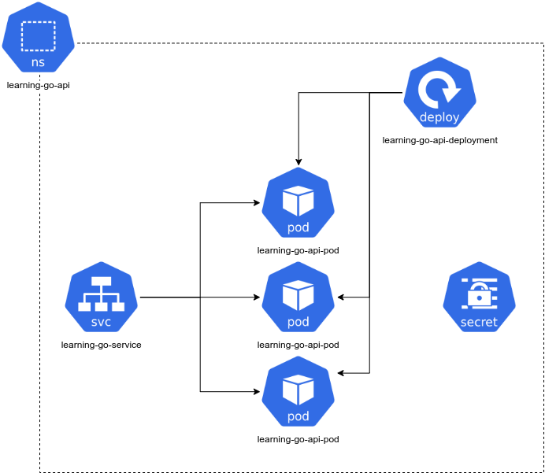

# Create a Helm chart for the API

[Helm](https://helm.sh) is a package manager for Kubernetes. It helps you
define, install, and upgrade even the most complex Kubernetes application.

From the [Helm introduction video](https://www.youtube.com/watch?v=Zzwq9FmZdsU):

> __Package Management:__ Tooling that enables someone who has knowledge of an
> application and a platform to package up an application so that someone else
> with who has neither extensive knowledge of the application or the way it
> needs to be run on the platform can use it.

Watch the video linked above before proceeding.

To install Helm follow the instructions at
[https://helm.sh/docs/intro/install](https://helm.sh/docs/intro/install).

One of the most important concepts in Helm are
[charts](https://helm.sh/docs/topics/charts):

> Helm uses a packaging format called charts. A chart is a collection of files
> that describe a related set of Kubernetes resources. A single chart might be
> used to deploy something simple, like a memcached pod, or something complex,
> like a full web app stack with HTTP servers, databases, caches, and so on.

To store the infrastructure related configurations we are going to create a new
repository named `learning-go-api-iac`. Head to GitHub and create it. After 
clone it to your machine so we can start building a chart for the API.

To create a chart execute the following command:

```sh
mkdir helm && cd helm
helm create learning-go-api
```

After running the following files and directories will be created:

```
learning-go-api
├── charts                  # A directory containing any charts upon which this chart depends
├── Chart.yaml              # A YAML file containing information about the chart
├── templates               # A directory of templates that, when combined with values,
                            # will generate valid Kubernetes manifest files
│   ├── deployment.yaml     # Template for a deployment (DELETE IF NOT NEEDED)
│   ├── _helpers.tpl        # Helper templates to be used in other templates
│   ├── hpa.yaml            # Template for auto scaling (DELETE IF NOT NEEDED)
│   ├── ingress.yaml        # Template for an ingress (DELETE IF NOT NEEDED)
│   ├── NOTES.txt           # OPTIONAL: A plain text file containing short usage notes
│   ├── serviceaccount.yaml # Template for a service account (DELETE IF NOT NEEDED)
│   ├── service.yaml        # Template for a service (DELETE IF NOT NEEDED)
│   └── tests               # Pod definitions to check the status of the application
└── values.yaml             # The default configuration values for this chart
```

We are going the build the following:

1. Namespace (ns) dedicated to the learning-go-api
1. Service (svc) exposing the API and loadbalancing the trafic to pods
1. Deployment (deploy) to manage and scale pods
1. Pods (pod) managed by the deployment
1. Secret (secret) containing the API key to call the backend financial API

The following diagram ilustrates all the components:



Let's start changing the generated templates to build this solution.

## Clean up

We are not going to some of the files generated by the `helm create` command so
let's do some clean up.

```sh
rm helm/learning-go-api/templates/ingress.yaml
rm helm/learning-go-api/templates/serviceaccount.yaml
rm helm/learning-go-api/templates/hpa.yaml
```
## Values 

Let's open the `value.yaml` file and update a couple of things:

1. The `image.repository` should be `renato0307/learning-go-api`
1. The `serviceAccount.create` must be set to `false`
1. The `service.type` must be `LoadBalancer` and the `service.port` change 
to 9000
1. In the `resources` section uncomment the values

Open the `Chart.yaml` file and update the following:

1. `appVersion` must match the GitHub tab for the `learning-go-api`, which
should be `0.0.3` at this moment.


## Create the namespace

```sh
kubectl create ns learning-go-api
```


## Secrets

We are going to use secrets to store the API key for the currency conversion.

First create a file named `secrets.yaml` with the following contents:

```yaml
apiVersion: v1
kind: Secret
metadata:
  name: learning-go-api-secrets
type: Opaque
data:
  CURRCONV_API_KEY: <the value of the API key in base64>
```

Next apply it:

```sh
kubectl apply -f secrets.yaml -n learning-go-api
```

The result should be:

```
secret/learning-go-api-secrets created
```

Delete the file:
```sh
rm secrets.yaml
```

## Deployment changes

Opent the `deployment.yaml` and in the `containers` list, add the
CURRCONV_API_KEY environment variable. Additionaly also change the container
port to be 8080, the default for Gin.

```yaml
containers:
    - name: {{ .Chart.Name }}
        securityContext:
        {{- toYaml .Values.securityContext | nindent 12 }}
        image: "{{ .Values.image.repository }}:{{ .Values.image.tag | default .Chart.AppVersion }}"
        imagePullPolicy: {{ .Values.image.pullPolicy }}
        env:                                    # new
        - name: CURRCONV_API_KEY                # new
          valueFrom:                            # new
            secretKeyRef:                       # new
                name: learning-go-api-secrets   # new
                key: CURRCONV_API_KEY           # new
        ports:
            - name: http
              containerPort: 8080               # change
```

## Install the chart

Next run the `helm install` command:

```sh
helm install learning-go-api helm/learning-go-api --namespace learning-go-api
```

If you list the pods for the `learning-go-api` namespace, you should see
something simitar to:

```sh
kubectl -n learning-go-api get pods
```

```sh
NAME                               READY   STATUS    RESTARTS   AGE
learning-go-api-6f7b4d9f79-64cpr   1/1     Running   0          84s
```

If we get the logs from the pod we should see the requests being made by the
liveness and readiness probes:

```sh
kubectl -n learning-go-api logs learning-go-api-6f7b4d9f79-64cpr 
```

```sh
...
[GIN] 2021/12/28 - 20:26:44 | 200 |       30.38µs |      10.244.0.1 | GET      "/"
[GIN] 2021/12/28 - 20:26:44 | 200 |       30.89µs |      10.244.0.1 | GET      "/"
[GIN] 2021/12/28 - 20:26:54 | 200 |       36.04µs |      10.244.0.1 | GET      "/"
[GIN] 2021/12/28 - 20:26:54 | 200 |       36.28µs |      10.244.0.1 | GET      "/"
[GIN] 2021/12/28 - 20:27:04 | 200 |      37.859µs |      10.244.0.1 | GET      "/"
[GIN] 2021/12/28 - 20:27:04 | 200 |       15.06µs |      10.244.0.1 | GET      "/"
[GIN] 2021/12/28 - 20:27:14 | 200 |       33.88µs |      10.244.0.1 | GET      "/"
[GIN] 2021/12/28 - 20:27:14 | 200 |        24.8µs |      10.244.0.1 | GET      "/"
```
## Service

The service sould also be set up. You can check it by running:

```sh
kubectl -n learning-go-api get svc
```

You'll be able to see something like:

```
NAME              TYPE           CLUSTER-IP      EXTERNAL-IP      PORT(S)          AGE
learning-go-api   LoadBalancer   10.96.151.196   172.19.255.200   9000:31144/TCP   21m
```

Using the `EXTERNAL-IP` you would be able to call the API using `httpie`:

```sh
http 172.19.255.200:9000
```

The result should be:

```
HTTP/1.1 200 OK
Content-Length: 51
Content-Type: application/json; charset=utf-8
Date: Wed, 28 Dec 2021 20:45:52 GMT

{
    "message": "Hello, welcome to the learning-go-api"
}
```