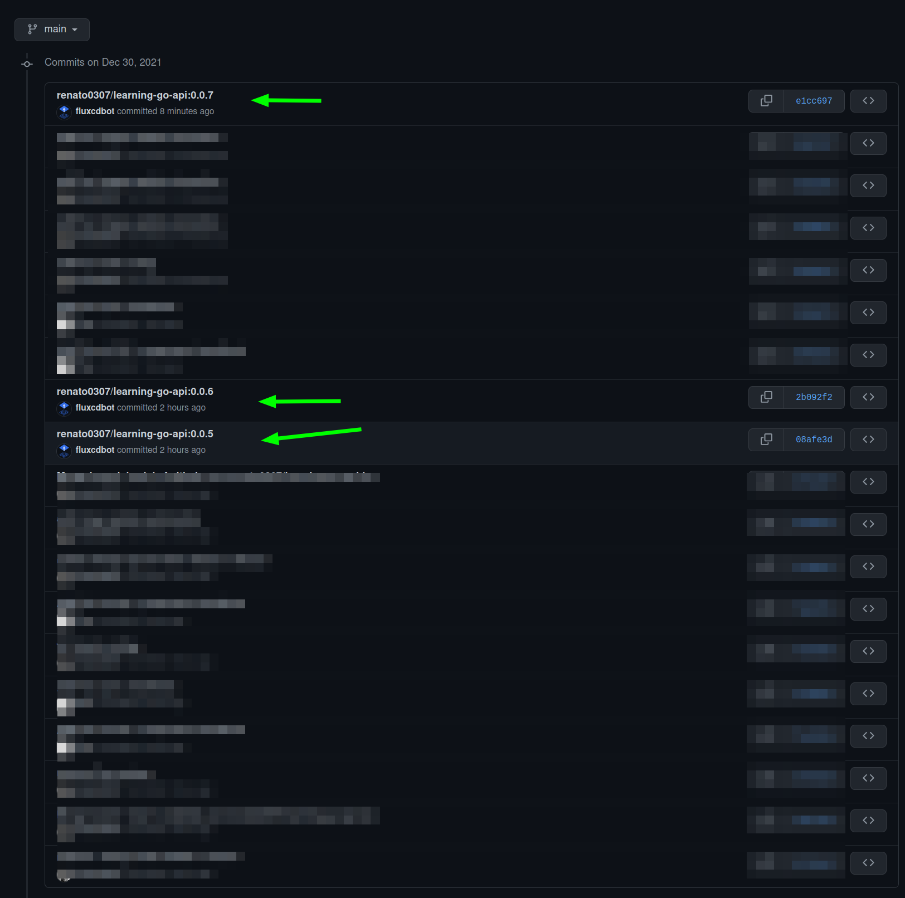

# Deploy the API using Flux

From the [Flux documentation](https://fluxcd.io/docs/):

> Flux is a tool for keeping Kubernetes clusters in sync with sources of 
> configuration (like Git repositories), and automating updates to configuration 
> when there is new code to deploy.

We are going to achieve the following:

1. Each time we update the Helm chart it gets automatically deployed
1. Each time a new image is updated it gets automatically deployed

To do that we need:

1. Install the Flux CLI
1. Bootstrap Flux in our local k8s cluster
1. Configure a Flux Helm Repository
1. Configure a Flux Helm Release
1. Configure Flux image repository and automation policy


## Uninstall Helm release

As Flux will be managing the Helm releases, we need to remove the Helm release
create in the last section.

Use the following command:

```sh
helm uninstall learning-go-api --namespace learning-go-api
```

## Install Flux CLI

The Flux CLI can be installed following the 
[official documentation](https://fluxcd.io/docs/installation/#install-the-flux-cli).

⚠ Don't follow any other step besides the installation of the CLI.


## Bootstrap Flux in our local k8s cluster

To bootstrap Flux you need to export your GitHub personal token as an 
environment variable:

```sh
export GITHUB_TOKEN=<your-token>
```

Next, in the `learning-go-api-iac` local repository, create a folder to store
the Flux configurations:

```sh
mkdir flux
```

Run the bootstrap for the `learning-go-api-iac` on your personal GitHub account:

```sh
flux bootstrap github \
  --owner=renato0307 \
  --repository=learning-go-api-iac \
  --personal \
  --path=./flux \
  --read-write-key \
  --components-extra=image-reflector-controller,image-automation-controller
```

I want to highlight some of the actions executed by this command:

1. Creates a list of k8s resources
1. The definitions of those resources are added to the repository indicated in
the bootstrap command, in the path indicated by `--path`
1. Adds an SSH deploy key to the repository, with read-write permissions

After the command executes successfully you should see in the terminal
something like:

```
(...)
◎ waiting for Kustomization "flux-system/flux-system" to be reconciled
✔ Kustomization reconciled successfully
► confirming components are healthy
✔ helm-controller: deployment ready
✔ image-automation-controller: deployment ready
✔ image-reflector-controller: deployment ready
✔ kustomize-controller: deployment ready
✔ notification-controller: deployment ready
✔ source-controller: deployment ready
✔ all components are healthy
```

Next if you execute a `git pull`, the config files used to deploy Flux are
updated locally:

```
remote: Enumerating objects: 25, done.
remote: Counting objects: 100% (25/25), done.
remote: Compressing objects: 100% (16/16), done.
remote: Total 21 (delta 8), reused 13 (delta 0), pack-reused 0
Unpacking objects: 100% (21/21), 27.05 KiB | 814.00 KiB/s, done.
From github.com:renato0307/learning-go-api-iac
   b75329f..d35647b  main       -> origin/main
Updating b75329f..d35647b
Fast-forward
 clusters/local-kind/release.yaml      |    4 +-
 flux/flux-system/gotk-components.yaml | 6403 ++++++++
 flux/flux-system/gotk-sync.yaml       |   27 +
 flux/flux-system/kustomization.yaml   |    5 +
 4 files changed, 6437 insertions(+), 2 deletions(-)
 create mode 100644 flux/flux-system/gotk-components.yaml
 create mode 100644 flux/flux-system/gotk-sync.yaml
 create mode 100644 flux/flux-system/kustomization.yaml
 ```

If you want to understand what components are created, feel free to take a look
into those files.

As an alternative you can run a `kubectl get all` in the `flux-system`
namespace:

```sh
kubectl -n flux-system get all
```

The result should be similar to:

```
NAME                                               READY   STATUS    RESTARTS   AGE
pod/helm-controller-779b58df6b-ppjgs               1/1     Running   0          7m39s
pod/image-automation-controller-787b4cf8b7-ts9r9   1/1     Running   0          7m39s
pod/image-reflector-controller-6d94666b7d-2ttt2    1/1     Running   0          7m39s
pod/kustomize-controller-5db6bfc56d-k7kpc          1/1     Running   0          7m39s
pod/notification-controller-7ccfbfbb98-pmlgf       1/1     Running   0          7m39s
pod/source-controller-565f8fbbff-lnw4m             1/1     Running   0          7m39s

NAME                              TYPE        CLUSTER-IP      EXTERNAL-IP   PORT(S)   AGE
service/notification-controller   ClusterIP   10.96.228.107   <none>        80/TCP    7m39s
service/source-controller         ClusterIP   10.96.181.190   <none>        80/TCP    7m39s
service/webhook-receiver          ClusterIP   10.96.154.81    <none>        80/TCP    7m39s

NAME                                          READY   UP-TO-DATE   AVAILABLE   AGE
deployment.apps/helm-controller               1/1     1            1           7m39s
deployment.apps/image-automation-controller   1/1     1            1           7m39s
deployment.apps/image-reflector-controller    1/1     1            1           7m39s
deployment.apps/kustomize-controller          1/1     1            1           7m39s
deployment.apps/notification-controller       1/1     1            1           7m39s
deployment.apps/source-controller             1/1     1            1           7m39s

NAME                                                     DESIRED   CURRENT   READY   AGE
replicaset.apps/helm-controller-779b58df6b               1         1         1       7m39s
replicaset.apps/image-automation-controller-787b4cf8b7   1         1         1       7m39s
replicaset.apps/image-reflector-controller-6d94666b7d    1         1         1       7m39s
replicaset.apps/kustomize-controller-5db6bfc56d          1         1         1       7m39s
replicaset.apps/notification-controller-7ccfbfbb98       1         1         1       7m39s
replicaset.apps/source-controller-565f8fbbff             1         1         1       7m39s
```
## Configure a Flux Helm Repository

The next step is to tell Flux where to fetch Helm charts.

Inside the `flux` folder create the `helm-git-repository.yaml` file:

```sh
touch flux/helm-git-repository.yaml
```

The contents of this file are:

```yaml
apiVersion: source.toolkit.fluxcd.io/v1beta1
kind: GitRepository
metadata:
  name: learning-go-api-iac-repo
  namespace: flux-system
spec:
  interval: 1m
  url: https://github.com/renato0307/learning-go-api-iac
  ref:
    branch: main
  ignore: |
    # exclude all
    /*
    # include charts
     directory
    !/charts/
```

As you can see by the `kind` and `apiVersion` elements, this is a custom
resource type defined by Flux.

## Configure a Flux Helm Release

The next step is to tell Flux which charts to install.

Inside the `flux` folder create the `helm-release.yaml` file:

```sh
touch flux/helm-release.yaml
```

The contents of this file are:

```yaml
apiVersion: helm.toolkit.fluxcd.io/v2beta1
kind: HelmRelease
metadata:
  name: learning-go-api
  namespace: learning-go-api
spec:
  interval: 5m
  chart:
    spec:
      interval: 1m
      chart: ./charts/learning-go-api
      version: '>=0.0.1 <1.0.0'
      sourceRef:
        kind: GitRepository
        name: learning-go-api-iac-repo
        namespace: flux-system
  values:
    image:
      tag: 0.0.3 # {"$imagepolicy": "flux-system:learning-go-api:tag"}
    replicaCount: 2
```

Let's take a look at the `spec/chart` element:

1. It will check for new versions every minute
1. The chart to install in located in `./charts/learning-go-api`
1. It will update all charts with versions >=0.0.1 and <1.0.0
1. It will fetch the charts from the repository defined before

In the `spec/values` element:

1. It will override the image tag to be used in the Helm chart
1. The comment on the `tag` element will be used later to update the image
automatically (don't remove it)
1. It will override the number of pod replicas

## Commit and push the files

As Flux is already monitoring this repository, if you commit and push these two
files, Flux will apply them in the k8s cluster.

Let's do that:

```sh
git add .
git commit -m "add helm configurations to flux`
git push
```

After a couple of minutes if you get all resources from the `learning-go-api`
namespace you'll see the API deployed.

To get all resources execute:

```sh
kubectl -n learning-go-api get all
```

The result will be similar to:

```
NAME                                   READY   STATUS    RESTARTS   AGE
pod/learning-go-api-7c8878597b-7snnm   1/1     Running   0          2m15s
pod/learning-go-api-7c8878597b-zbfxd   1/1     Running   0          2m15s

NAME                      TYPE           CLUSTER-IP     EXTERNAL-IP      PORT(S)          AGE
service/learning-go-api   LoadBalancer   10.96.153.36   172.19.255.200   9000:32741/TCP   2m15s

NAME                              READY   UP-TO-DATE   AVAILABLE   AGE
deployment.apps/learning-go-api   2/2     2            2           2m15s

NAME                                         DESIRED   CURRENT   READY   AGE
replicaset.apps/learning-go-api-7c8878597b   2         2         2       2m15s
```

Before we turn on the image automation, let's check the version being used
by the pods:

```sh
kubectl -n learning-go-api describe deploy learning-go-api
```

The result should be:

```
Name:                   learning-go-api
Namespace:              learning-go-api
CreationTimestamp:      Thu, 30 Dec 2021 08:40:55 +0000
Labels:                 app.kubernetes.io/instance=learning-go-api
                        app.kubernetes.io/managed-by=Helm
                        app.kubernetes.io/name=learning-go-api
                        app.kubernetes.io/version=0.0.3
                        helm.sh/chart=learning-go-api-0.1.0
                        helm.toolkit.fluxcd.io/name=learning-go-api
                        helm.toolkit.fluxcd.io/namespace=learning-go-api
Annotations:            deployment.kubernetes.io/revision: 1
                        meta.helm.sh/release-name: learning-go-api
                        meta.helm.sh/release-namespace: learning-go-api
Selector:               app.kubernetes.io/instance=learning-go-api,app.kubernetes.io/name=learning-go-api
Replicas:               2 desired | 2 updated | 2 total | 2 available | 0 unavailable
StrategyType:           RollingUpdate
MinReadySeconds:        0
RollingUpdateStrategy:  25% max unavailable, 25% max surge
Pod Template:
  Labels:           app.kubernetes.io/instance=learning-go-api
                    app.kubernetes.io/name=learning-go-api
  Service Account:  default
  Containers:
   learning-go-api:
    Image:      renato0307/learning-go-api:0.0.3
    Port:       8080/TCP
    Host Port:  0/TCP
(...)
```

As we can see, version `0.0.3` is in use.

## Configure Flux image repository and automation policy

To make Flux update the images in the Helm chart we need to configure three
resources:

1. The image repository
1. An image policy to define which images should we monitor to update
1. An image update automation

This can be achieved by running the following commands.


The first one generates an `ImageRepository` resource which checks for images
in my personal Docker Hub repository:


```ssh
flux create image repository learning-go-api \
--image=renato0307/learning-go-api \
--interval=1m \
--export > ./flux/image-repository.yaml
```

The second one generates an `ImagePolicy` resource so Flux checks for image
with versions >=0.0.1 and <1.0.0:

```ssh
flux create image policy learning-go-api \
--image-ref=learning-go-api \
--select-semver='>=0.0.1 <1.0.0' \
--export > ./flux/image-policy.yaml
```

The last one generates an `ImageUpdateAutomation` resource which sets the 
GitHub repository settings that allow to update the Helm releases.

```ssh
flux create image update flux-system \
--git-repo-ref=flux-system \
--git-repo-path=./flux \
--checkout-branch=main \
--push-branch=main \
--author-name=fluxcdbot \
--author-email=fluxcdbot@users.noreply.github.com \
--commit-template="{{range .Updated.Images}}{{println .}}{{end}}" \
--export > ./flux/image-update-automation.yaml
```

⚠ This will effectively change files in the GitHub repository.

After running all commands, feel free to inspect the content of the files.

## Commit and push the files

As Flux is already monitoring this repository, if you commit and push these two
files, Flux will apply them in the k8s cluster.

Let's do that:

```sh
git add .
git commit -m "add flux image update automation`
git push
```

After a couple of minutes we can check the image update resources.


For the image repositories run:

```sh
kubectl -n flux-system get imagerepositories.image.toolkit.fluxcd.io
```

The result should be similar to:

```
NAME              LAST SCAN              TAGS
learning-go-api   2021-12-30T09:07:33Z   3
```

For the image policies run:

```sh
kubectl -n flux-system get imagepolicies.image.toolkit.fluxcd.io
```

The result should be similar to:

```
NAME              LATESTIMAGE
learning-go-api   renato0307/learning-go-api:0.0.3
```


For the image update automation run:

```sh
kubectl -n flux-system get imageupdateautomations.image.toolkit.fluxcd.io
```

The result should be similar to:

```
NAME          LAST RUN
flux-system   2021-12-30T07:09:41Z
```

## Deploying a new image of the API

To deploy a new image of the API, we need to create a new tag.

Go to the `learning-go-api` repository and run:

```sh
git tag -a v0.0.4 -m "v0.0.4"
git push origin v0.0.4
```

Wait for a couple of minutes for the build image GitHub action to generate and
publish the images in Docker Hub.

Running the following command

```sh
kubectl -n flux-system get imagepolicies.image.toolkit.fluxcd.io
```

We can see Flux already detected the latest version of the image:

```
NAME              LATESTIMAGE
learning-go-api   renato0307/learning-go-api:0.0.4
```

If we list the pods

```sh
kubectl -n learning-go-api get po
```

We will see some terminating and another ones with a very recent `AGE`
(if you don't see it, wait a couple more minutes):

```
NAME                               READY   STATUS        RESTARTS   AGE
learning-go-api-58c875f648-v9vzr   1/1     Running       0          17s
learning-go-api-58c875f648-wqbvt   1/1     Running       0          9s
learning-go-api-7c8878597b-7snnm   0/1     Terminating   0          37m
```


We can describe one of the pods:

```sh
kubectl -n learning-go-api describe po learning-go-api-58c875f648-v9vzr
```

And check the image version in use:

```
Image:          renato0307/learning-go-api:0.0.4
```

If you head to GitHub you'll be able to see the commits done by Flux, due to
the image updates:



## Wrap up

And that's it.

We are now able to deploy our API automatically just by creating new tags in
GitHub.