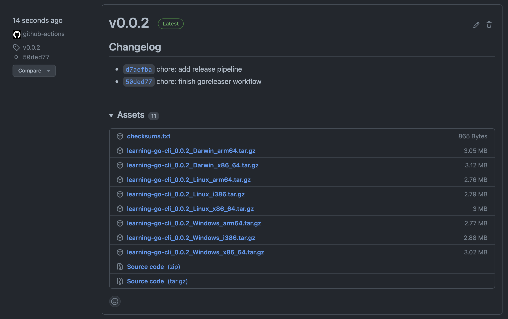

# CI/CD for the CLI

Each time we want create a new tag in GitHub for the CLI, we want to release a
new version.

Each release will contain the the CLI compiled for several architectures and
operating systems.

To achieve that we are going to use [GoReleaser](https://goreleaser.com).

## Installation and basic configurations

Let's start by installing GoReleaser following the instructions in 
[install page](https://goreleaser.com/install).

Next, generate the GoReleaser configuration file by running:

```sh
goreleaser init
```

This will generate a file named `.goreleaser.yaml` and add the `dist` folder to
the `.gitignore` file. 

Let's clean up a bit the `.goreleaser.yaml` file:

```yaml
before:
  hooks:
    - go mod tidy
builds:
  - env:
      - CGO_ENABLED=0
    goos:
      - linux
      - windows
      - darwin
archives:
  - replacements:
      darwin: Darwin
      linux: Linux
      windows: Windows
      386: i386
      amd64: x86_64
checksum:
  name_template: 'checksums.txt'
snapshot:
  name_template: "{{ incpatch .Version }}-next"
changelog:
  sort: asc
  filters:
    exclude:
      - '^docs:'
      - '^test:'
```

You can test the configuration by running:

```sh
goreleaser release --snapshot --rm-dist
```

If you inspect the `dist` folder you can see the binaries for several operating
systems.

You can try to run the one for your case (mine is linux):

```sh
 ./dist/learning-go-cli_linux_amd64/learning-go-cli
 ```

 Which should output:

 ```terminal
The learning-go-api provides with utility functions like UUID
generation, a currency converter, a JWT debugger, etc.

Usage:
  learning-go-cli [command]

Available Commands:
  completion  Generate the autocompletion script for the specified shell
  configure   Configures the CLI
  help        Help about any command
  programming Programming tools

Flags:
  -h, --help      help for learning-go-cli
  -v, --version   version for learning-go-cli

Use "learning-go-cli [command] --help" for more information about a command.
 ```

## Adding a GitHub action

We will create a GitHub action to release the CLI each time a new tag is
created. 

As we don't have any workflow let's create the base folder for workflows:

```sh
mkdir -p .github/workflows
```

Then create the `.github/workflows/release.yaml` file with the following
contents:

```yaml
name: goreleaser

on:
  push:
    tags:
      - '*'

jobs:
  goreleaser:
    runs-on: ubuntu-latest
    steps:
      -
        name: Checkout
        uses: actions/checkout@v2
        with:
          fetch-depth: 0
      -
        name: Set up Go
        uses: actions/setup-go@v2
        with:
          go-version: 1.17
      -
        name: Run GoReleaser
        uses: goreleaser/goreleaser-action@v2
        with:
          distribution: goreleaser
          version: latest
          args: release --rm-dist
        env:
          GITHUB_TOKEN: ${{ secrets.GITHUB_TOKEN }}
```

After, let's test it with `act` like we did before. 

We need to create the `.github/workflows/push-tag.json` file:

```sh
touch .github/workflows/push-tag.json
```

The file contents are:

```json
{
    "push": {
        "ref": "refs/tags/v0.0.1"
    }
}
```

Run `act`:

```sh
act push \
    -e .github/workflows/push-tag.json \
    -s GITHUB_TOKEN \
    --verbose
```

Wait for the command to finish.

 ## Wrap up

 Create and push a tag:

```sh
git tag -a v0.0.1 -m "v0.0.1"  
git push origin v0.0.1
```

After a couple of minutes, head to GitHub and a new release should be created.

The contents will be similar to:



# Next
 
The next section is
[Challenge: Add the programming/jwtdebugger command to the CLI](it7-cli-add-programming-jwtdebugger-cmd.md).