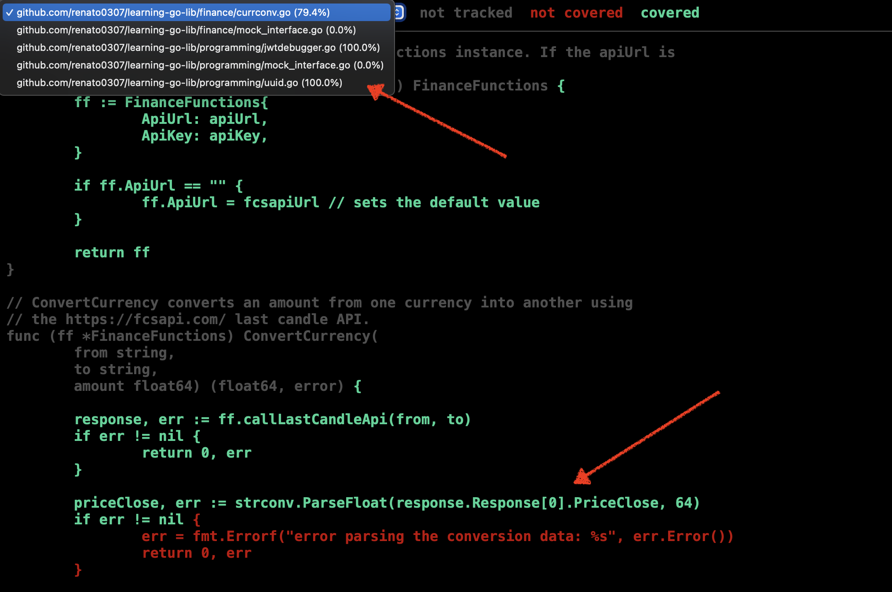
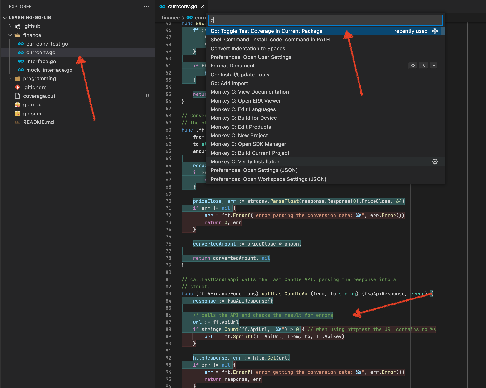

# How to check the test coverage?

I'm going to show you two ways of checking the test coverage:

1. From the command line
1. Inside VS Code

## From the command line

First head to the `learning-go-lib` project folder.

The simplest way to check the test code coverage is to run the test command 
with the `-cover` flag:

```sh
go test ./... -cover
```

The result should be similar to:

```terminal
ok      github.com/renato0307/learning-go-lib/finance   0.830s  coverage: 61.4% of statements
ok      github.com/renato0307/learning-go-lib/programming       0.667s  coverage: 35.5% of statements
```

As you can see, the `finance` package contains a coverage of 61.4% and the
`programming` package 35.5%. 

But if we want to check for details about which lines are covered we need to
export the test coverage information to a file:

```sh
go test ./...  -coverprofile=coverage.out
```

To see it visually you can generate an HTML report by running:

```sh
go tool cover -html=coverage.out
```

The command will open the report in the browser:



You can use the drop down in the top to select the file and check for the
details. The lines in green are covered by tests and the lines in red are not.

## Inside VS Code

When using VS Code you can see directly the code coverage for a specific file:

1. Open the file
1. Run the command "Go: Toggle Test Coverage In Current Package"
1. The lines covered/uncovered will be signalled in green/red



# Next
 
The next section is
1. [Increase coverage in the Lib](it8-lib-test-code-coverage.md).