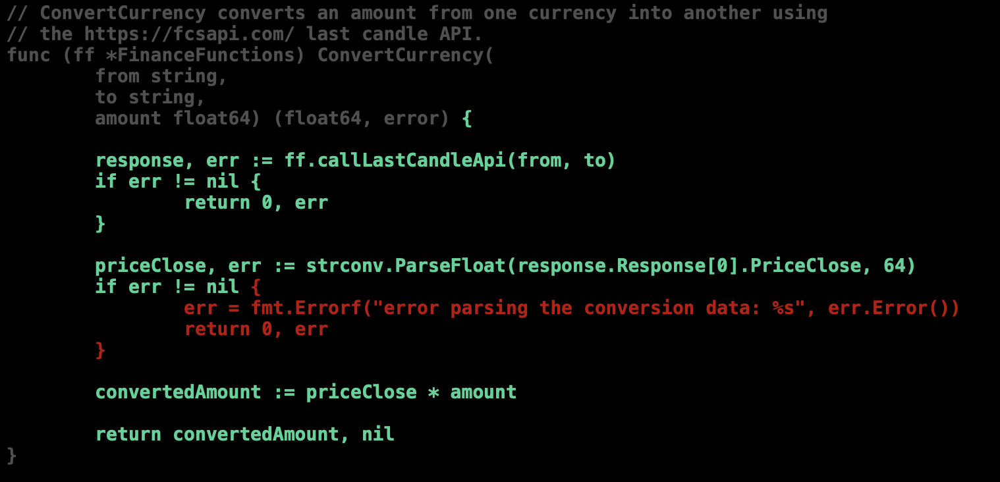

# Increase coverage in the Lib

If you run the test coverage like explained in the last section, you'll see
a very low number of test code coverage for the library.

```terminal
ok      github.com/renato0307/learning-go-lib/finance   0.830s  coverage: 61.4% of statements
ok      github.com/renato0307/learning-go-lib/programming       0.667s  coverage: 35.5% of statements
```

Checking the report we conclude the cause is the mock interface that are being
generated automatically and we don't have tests for them.

We would like to exclude them. As that is not possible when running the
`go test` command, we can move them to a separated folder:

```sh
mkdir -p finance/mock
mkdir -p programming/mock
mv finance/mock_interface.go finance/mock
mv programming/mock_interface.go programming/mock
```

If we run the test command again we get better numbers:

```sh
go test ./... -cover
```

The result is much better:

```terminal
ok      github.com/renato0307/learning-go-lib/finance   0.566s  coverage: 79.4% of statements
?       github.com/renato0307/learning-go-lib/finance/mock      [no test files]
ok      github.com/renato0307/learning-go-lib/programming       0.387s  coverage: 100.0% of statements
?       github.com/renato0307/learning-go-lib/programming/mock  [no test files]
```

In need to take a look into the `finance` package to understand were we can
increase the test code coverage.

By running the tests and the generating the report:

```sh
go test ./...  -coverprofile=coverage.out && go tool cover -html=coverage.out
```

We can see that we are missing tests for some error handling blocks.

Let's tackle one by one:



We need to add test where the value used for the currency conversion is not a 
float:

```go
func TestConvertCurrencyWithInvalidPriceClose(t *testing.T) {
	// arrange
	expected := // the "c" value is not a float
		`
		{
			"code": 200,
			"info": {
				"_t": "2021-12-27 21:49:18 UTC",
				"credit_count": 1,
				"server_time": "2021-12-27 21:49:18 UTC"
			},
			"msg": "Successfully",
			"response": [
				{
					"c": "i'm not a float",
					"ch": "-0.00013",
					"cp": "-0.01%",
					"h": "1.13281",
					"id": "1",
					"l": "1.13246",
					"o": "1.13281",
					"s": "EUR/USD",
					"t": "1640638800",
					"tm": "2021-12-27 21:00:00",
					"up": "2021-12-27 21:49:10"
				}
			],
			"status": true
		}
	`

	svr := httptest.NewServer(http.HandlerFunc(func(w http.ResponseWriter, r *http.Request) {
		fmt.Fprint(w, expected)
	}))
	defer svr.Close()

	ff := NewFinanceFunctions(svr.URL, "DummyApiKey")

	// act
	_, err := ff.ConvertCurrency("EUR", "USD", 10)

	// assert
	assert.NotNil(t, err)
	assert.Contains(t, err.Error(), "error parsing the conversion data")
}
```

By running the test coverage command again we get an increase to 85.3%:

```terminal
github.com/renato0307/learning-go-lib/finance   0.206s  coverage: 85.3% of statements
```

Let's check other error handling blocks and add tests for them:

```go
func TestConvertCurrencyWithInvalidProtocolUrl(t *testing.T) {
	// arrange
	invalidFcsapiUrl := "xxxx://someurl"
	ff := NewFinanceFunctions(invalidFcsapiUrl, "DummyApiKey")

	// act
	result, err := ff.ConvertCurrency("EUR", "USD", 10)

	// assert
	assert.NotNil(t, err)
	assert.Contains(t, err.Error(), "unsupported protocol scheme")
	assert.Equal(t, 0.0, result)
}

func TestConvertCurrencyWithUrlVarReplacement(t *testing.T) {
	// arrange
	invalidFcsapiUrl := "https://fcsapi.com/api-v3/forex/candle?symbol=%s/%s&period=1h&access_key=%s"
	ff := NewFinanceFunctions(invalidFcsapiUrl, "DummyApiKey")

	// act
	result, err := ff.ConvertCurrency("EUR", "USD", 10)

	// assert
	assert.NotNil(t, err)
	assert.NotContains(t, err.Error(), "%s")
	assert.Equal(t, 0.0, result)
}
```

Running the tests again results in more than 90% of coverage:

```terminal
ok      github.com/renato0307/learning-go-lib/finance   0.916s  coverage: 94.6% of statements
```

The last error block is harder to tackle and it will require a small code
refactoring.

```go
// ...
	body, err := ioutil.ReadAll(httpResponse.Body)
	if err != nil {
		err = fmt.Errorf("error reading the conversion data: %s", err.Error())
		return response, err
	}
// ...
```

We first will extract this code to a function so we can test it isolated:

```go
// ...
	body, err := readBody(httpResponse.Body)
	if err != nil {
		return response, err
	}
// ...    
```

Where `readBody` is:

```go
func readBody(bodyReader io.ReadCloser) ([]byte, error) {
	defer bodyReader.Close()
	body, err := ioutil.ReadAll(bodyReader)
	if err != nil {
		return []byte{}, fmt.Errorf("error reading the conversion data: %s", err.Error())
	}

	return body, nil
}
```

To test this change we need to pass to the `readBody` function a fake
`ReaderCloser`, which always returns an error:

```go
type errReader int

func (errReader) Read(p []byte) (n int, err error) {
	return 0, errors.New("test error")
}

func (errReader) Close() error {
	return nil
}
```

The test code is:

```go
func TestReadBody(t *testing.T) {
	// arrange
	bodyReader := errReader(0)

	// act
	body, err := readBody(bodyReader)

	// assert
	assert.Error(t, err)
	assert.Empty(t, body)
}
```

Running the tests again we get 97.5% of code coverage which is good enough:

```terminal
ok      github.com/renato0307/learning-go-lib/finance   0.737s  coverage: 97.5% of statements
```

## Wrap up

Commit, push and create a new tag:

```sh
git add .
git commit -m "refactor: move mocks to a separate folder" -m "test: increase coverage"
git push
git tag -a v0.0.5 -m "v0.0.5"
git push origin v0.0.5
```

# Next
 
The next section is
[Increase coverage in the API](it8-api-test-code-coverage.md).